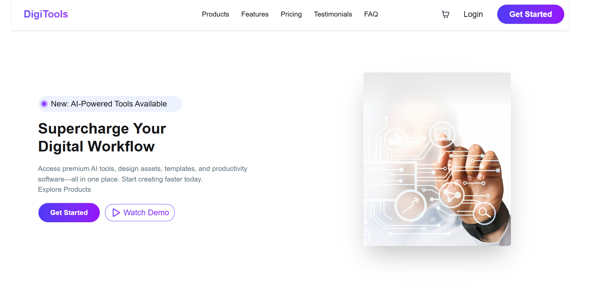

# 🚀 Premium Digital Tools Website

A modern and responsive web application that showcases premium digital tools and products with a clean UI and smooth user experience.

---

## 🌐 Live Website

👉 https://premiumdigitalwebsite.netlify.app/

---

## 📌 Project Overview

This project is a digital tools marketplace where users can explore premium tools, pricing plans, and features. It is designed with a focus on modern UI/UX and responsiveness across all devices.

---

## ✨ Features

- 📱 Fully responsive design (Mobile, Tablet, Desktop)
- 🎨 Clean and modern UI
- 🛒 Product showcase section
- 💰 Pricing plans (Starter, Pro, Enterprise)
- 📊 Statistics section (Users, Tools, Ratings)
- 🚀 Call-to-action sections (Get Started, Buy Now)
- ⚡ Smooth navigation and layout

---

## 🛠️ Technologies Used

- HTML5  
- CSS3  
- Tailwind CSS  
- JavaScript  
- React
---

